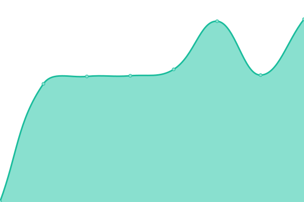

# [📈 Live Status](https://status.weezevent.com): <!--live status--> **🟧 Partial outage**

This repository contains the open-source uptime monitor and status page for [Weezevent](https://status.weezevent.com), powered by [Upptime](https://github.com/upptime/upptime).

With [Upptime](https://upptime.js.org), you can get your own unlimited and free uptime monitor and status page, powered entirely by a GitHub repository. We use [Issues](https://github.com/upptime/upptime/issues) as incident reports, [Actions](https://github.com/Weezevent/status-page/actions) as uptime monitors, and [Pages](https://demo.upptime.js.org) for the status page.

<!--start: status pages-->
<!-- This summary is generated by Upptime (https://github.com/upptime/upptime) -->
<!-- Do not edit this manually, your changes will be overwritten -->
<!-- prettier-ignore -->
| URL | Status | History | Response Time | Uptime |
| --- | ------ | ------- | ------------- | ------ |
|  [Weezevent](https://weezevent.com/en-gb/) | 🟩 Up | [weezevent.yml](https://github.com/Weezevent/status-page/commits/HEAD/history/weezevent.yml) | 

 1497ms
     
 | 

<a href="https://Weezevent.github.io/status-page/history/weezevent">100.00%</a>
    

|  [WeezTicket](https://api.weezevent.com/ticket/health) | 🟩 Up | [weez-ticket.yml](https://github.com/Weezevent/status-page/commits/HEAD/history/weez-ticket.yml) | 

 324ms
     
 | 

<a href="https://Weezevent.github.io/status-page/history/weez-ticket">100.00%</a>
    

|  [WeezAccess](https://api.weezevent.com/access/) | 🟩 Up | [weez-access.yml](https://github.com/Weezevent/status-page/commits/HEAD/history/weez-access.yml) | 

 342ms
     
 | 

<a href="https://Weezevent.github.io/status-page/history/weez-access">100.00%</a>
    

|  [WeezPay](https://api.weezevent.com/pay/) | 🟩 Up | [weez-pay.yml](https://github.com/Weezevent/status-page/commits/HEAD/history/weez-pay.yml) | 

 344ms
     
 | 

<a href="https://Weezevent.github.io/status-page/history/weez-pay">100.00%</a>
    

|  [WeezTarget](https://api.weezevent.com/target/) | 🟩 Up | [weez-target.yml](https://github.com/Weezevent/status-page/commits/HEAD/history/weez-target.yml) | 

 260ms
     
 | 

<a href="https://Weezevent.github.io/status-page/history/weez-target">100.00%</a>
    

|  [WeezPayment](lyria.weezevent.com/health) | 🟩 Up | [weez-payment.yml](https://github.com/Weezevent/status-page/commits/HEAD/history/weez-payment.yml) | 

 461ms
     
 | 

<a href="https://Weezevent.github.io/status-page/history/weez-payment">100.00%</a>
    

|  [Back-office](https://www.weezevent.com/bo/) | 🟥 Down | [back-office.yml](https://github.com/Weezevent/status-page/commits/HEAD/history/back-office.yml) | 

 1752ms
     
 | 

<a href="https://Weezevent.github.io/status-page/history/back-office">99.68%</a>
    

|  [Guichet / Ticket Office](https://guichet.weezevent.com/) | 🟩 Up | [guichet-ticket-office.yml](https://github.com/Weezevent/status-page/commits/HEAD/history/guichet-ticket-office.yml) | 

 905ms
     
 | 

<a href="https://Weezevent.github.io/status-page/history/guichet-ticket-office">100.00%</a>
    

<!--end: status pages-->

[**Visit our status website →**](https://status.weezevent.com)

## 📄 License

- Powered by: [Upptime](https://github.com/upptime/upptime)
- Code: [MIT](./LICENSE) © [Upptime](https://upptime.js.org)
- Data in the `./history` directory: [Open Database License](https://opendatacommons.org/licenses/odbl/1-0/)
